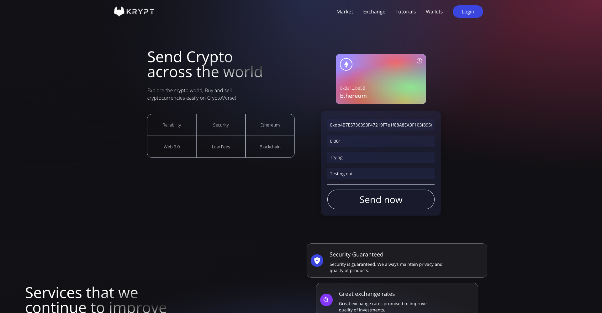

# Web3.0 mini project

Created my first blockchain related app combining a mixture of ReactJS and Solidity to create a basic smart contract.

### Functions
- Able to connect **MetaMask** wallets to the webpage
- Simple transactions between 2 different wallets
- List out existing transactions at the bottom part of the page

### Compatibility
- Any web browser that allows localhost:3000
- Mobile phones can display the webpage as well
